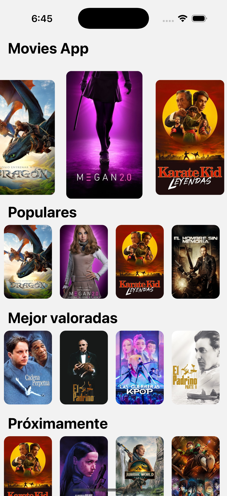
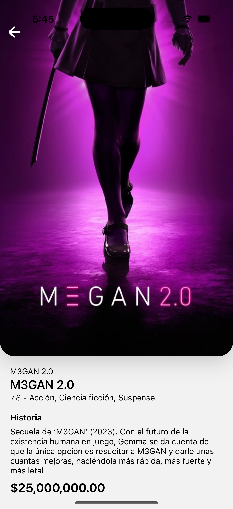

# 🎬 Movies App

Una aplicación móvil moderna para explorar películas, construida con React Native, Expo y TypeScript. Descubre las últimas películas, explora catálogos populares y obtén información detallada sobre tus filmes favoritos.

## 📱 Capturas de Pantalla

<div align="center">

### Pantalla Principal

_Explora películas por categorías: En Cartelera, Populares, Mejor Valoradas y Próximos Estrenos_



### Detalle de Película

_Información completa con poster, sinopsis, calificación y detalles técnicos_



</div>

## ✨ Características

- 🎭 **Exploración de Películas**: Navega por diferentes categorías como "Ahora en Cartelera", "Populares", "Mejor Valoradas" y "Próximos Estrenos"
- 📱 **Interfaz Moderna**: Diseño limpio y responsive usando NativeWind (Tailwind CSS para React Native)
- 🎨 **Experiencia Visual**: Carrusel principal con efectos visuales y transiciones suaves
- 📊 **Información Detallada**: Detalles completos de cada película incluyendo reparto, sinopsis y más
- ⚡ **Rendimiento Optimizado**: Gestión eficiente del estado con TanStack Query
- 🏗️ **Arquitectura Limpia**: Código organizado con principios de arquitectura limpia

## 🛠️ Tecnologías Utilizadas

### Frontend

- **React Native** - Framework para desarrollo móvil multiplataforma
- **Expo** - Plataforma para desarrollo universal de React Native
- **TypeScript** - Tipado estático para JavaScript
- **NativeWind** - Tailwind CSS para React Native
- **Expo Router** - Sistema de navegación basado en archivos

### Estado y Datos

- **TanStack Query** - Gestión de estado servidor y cache
- **Axios** - Cliente HTTP para APIs

### UI/UX

- **React Native Reanimated** - Animaciones de alto rendimiento
- **Expo Linear Gradient** - Gradientes nativos
- **React Native Carousel** - Componente de carrusel

## 🚀 Inicio Rápido

### Prerrequisitos

- Node.js (versión 18 o superior)
- npm o yarn
- Expo CLI instalado globalmente
- Un dispositivo móvil o emulador configurado

### Instalación

1. **Clona el repositorio**

   ```bash
   git clone git@github.com:BryanJGomez/movies-app.git
   cd movies-app
   ```

2. **Instala las dependencias**

   ```bash
   npm install
   ```

3. **Inicia la aplicación**

   ```bash
   npm start
   # o
   npx expo start
   ```

4. **Ejecuta en tu dispositivo**
   - Escanea el código QR con la app Expo Go (iOS/Android)
   - O presiona `i` para iOS Simulator
   - O presiona `a` para Android Emulator

## 📁 Estructura del Proyecto

```
movies-app/
├── app/                          # Rutas de la aplicación (Expo Router)
│   ├── home/                     # Pantalla principal
│   ├── movie/                    # Detalles de película
│   └── _layout.tsx               # Layout principal
├── core/                         # Lógica de negocio
│   ├── actions/                  # Casos de uso
│   └── api/                      # Configuración de APIs
├── infrastructure/              # Capa de datos
│   ├── interfaces/              # Tipos e interfaces
│   └── mappers/                 # Transformadores de datos
├── presentation/                # Capa de presentación
│   ├── components/              # Componentes reutilizables
│   └── hooks/                   # Hooks personalizados
└── assets/                      # Recursos estáticos
```

## 🧪 Scripts Disponibles

```bash
# Desarrollo
npm start                        # Inicia el servidor de desarrollo
npm run android                  # Ejecuta en Android
npm run ios                      # Ejecuta en iOS
npm run web                      # Ejecuta en navegador web

# Calidad de código
npm run lint                     # Ejecuta ESLint
```

## 🔧 Configuración

### Variables de Entorno

Crea un archivo `.env` en la raíz del proyecto:

```env
# API Configuration
MOVIE_DB_API_KEY=tu_api_key_aqui
MOVIE_DB_BASE_URL=https://api.themoviedb.org/3
```

### API de Películas

Esta aplicación utiliza The Movie Database (TMDB) API. Para obtener una clave API:

1. Regístrate en [TMDB](https://www.themoviedb.org/)
2. Ve a Configuración > API
3. Solicita una clave API
4. Agrega la clave a tu archivo `.env`

## 📄 Licencia

Este proyecto está bajo la Licencia MIT. Ver `LICENSE` para más detalles.
